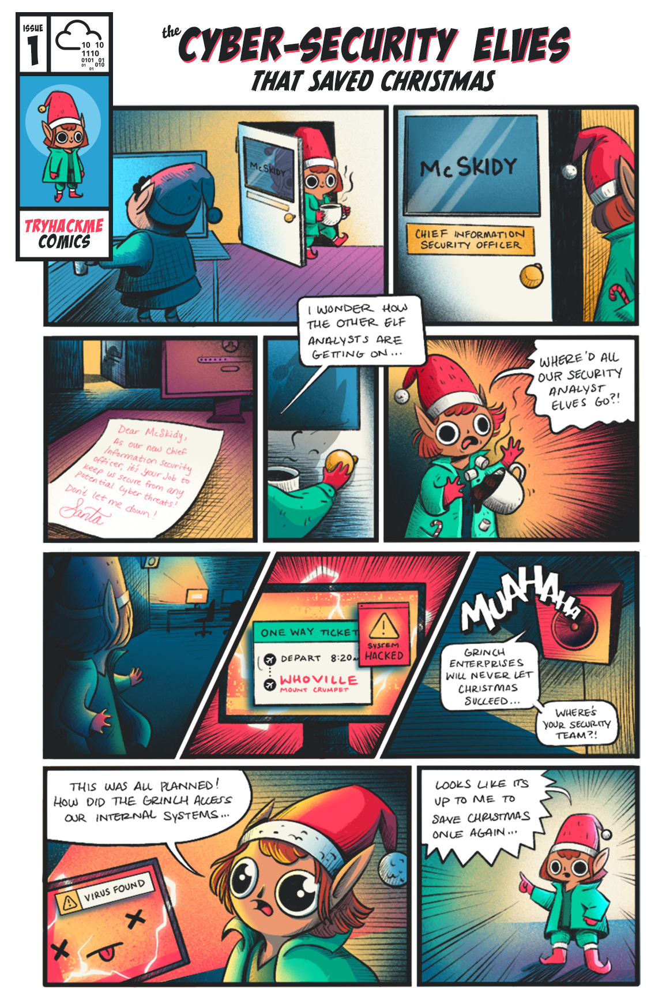

 # Advent of cyber 3 (2021)

Oh boy it's christmas soon and tryhackme is bein awesome again!

it's my first advent of cyber and I could not be more hyped

I wanted to do it for the christmas vibes and i discovered I could also win some stuff

I wish i could get the big prizes...but hey as long as we have fun

## The story

## Day 1 - Save the gifts

Hehe that was an easy warmup about `IDOR`. answers are to not be shared...yet!
I can't wait to see what they gve us tomorrow

## Day 2 - Elf HR problems
Today was easy-peasy too...just cookie manipulation with some decoding...they also said
the difficulty would increase day to day and now I am starting to worry a bit XD

## Day 3 - Christmas blackout
simple directory discovery with password guessing

## Day 4 - Santa's running Behind
fuzzing credentials with password.txt and burpsuite sniper 

## Day 5 - Christmas blackout
reflected xss

## Day 6 - Patch Management is hard
The warmup started with LFI...this is getting more and more interresting

## Day 7 - Migration without Security
Nosql injection on a mongodb database. 

## Day 8 - Santa's Bag of Toys
windows registry logs, base64 decoding, shellBagsExplorer

## Day 9 - Where is all this data going?
Pcap file analysis with wireshark

## Day 10 - Offensive is the best Defence
enumeration and analysis with nmap

## Day 11 - Where are the Reindeers
microsoft sql server (MSSQL) with `sqsh` tool

## Day 12 - Sharing without caring
Like the name suggests its about mounting an nfs share

## Day 13 - They lost the plan!
Windows privesc through Iperius backup service

## Day 14 - Dev(insecure)Ops
Or how automation doesnt always come with automatic security 

## Day 15 - The grinchs day off
this is a quizz about cybersecurity careers...took it twice same result
"penetration tester" Damn right! fun stuff! My favorite part was the success stories shared about people getting into cybersecurity from 
different carrer paths

## Day 16 - Ransomware Madness
pure OSINT

## Day 17 - Elf leaks
aws cloud investigation

