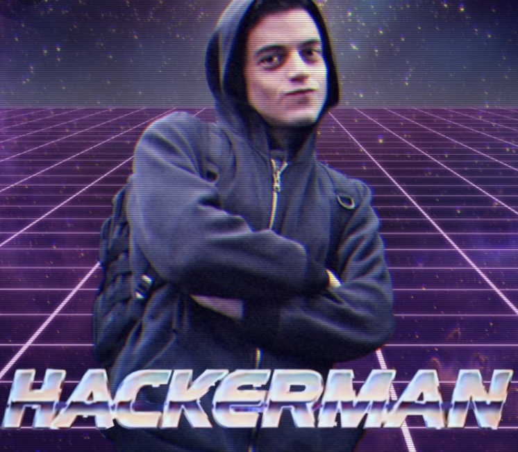

```
└──╼ $exif hackerman.jpg
Données corrompues
Les données fournies ne respectent pas les spécifications.
ExifLoader: Les données fournies ne semblent pas contenir de données EXIF.


└──╼ $steghide --info hackerman.jpg
"hackerman.jpg":
  format: jpeg
  capacit�: 7,0 KB
Essayer d'obtenir des informations � propos des donn�es incorpor�es ? (o/n) o
Entrez la passphrase: 
steghide: impossible d'extraire des donn�es avec cette passphrase!
```
When there is a passphrase there is cracking involved

stegcracker is one of the best...uhm I mean stegseek

```
└──╼ $stegseek  hackerman.jpg /usr/share/wordlists/rockyou.txt
StegSeek 0.6 - https://github.com/RickdeJager/StegSeek

[i] Progress: 99.98% (133.4 MB)           
[!] error: Could not find a valid passphrase.
```
wait! am I stupid? the passphrase was in plain sight!!!

`HACKERMAN`

```
└──╼ $steghide --info hackerman.jpg
"hackerman.jpg":
  format: jpeg
  capacit�: 7,0 KB
Essayer d'obtenir des informations � propos des donn�es incorpor�es ? (o/n) o
Entrez la passphrase: 
  fichier � inclure "secret.txt":
    taille: 14,0 Byte
    cryptage: rijndael-128, cbc
    compression: oui


└──╼ $steghide --extract -sf hackerman.jpg
Entrez la passphrase: 
�criture des donn�es extraites dans "secret.txt".
```
The `secret.txt` file introduce us to `Jake Bellagot`

We finally got a name...you know what to do...and we got a twitter account

`@JBellagot` talks about `NoobCon2020` and that picture with a QR code


Reading the qr code take us to `https://jakeyboybellagot.github.io/ubiquitous-waffle/`

When trying to contact him using the button you notice the link is encoded in base64

`Q1NMezk0YTA0OTBhZDZjMjcxNWFmMTI0OTA1NWE5YTVkYzI3fQ==` wich decodes to

`CSL{the_flag_goes_here}`

Done.

I really wanted to contact this guy, but he could blackhat me later