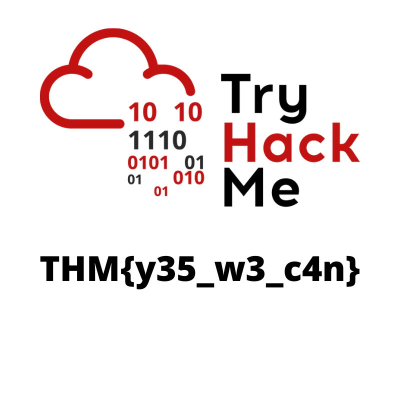

# CTF Collection Vol 1


## what does the base said?

Yeah this one is just base 64, please do not make a fool of yourself and just decode it

## Meta meta


```
└──╼ $exif Findme.jpg
Marqueurs EXIF dans « Findme.jpg » (ordre des octets « Motorola ») :
--------------------+----------------------------------------------------------
Marqueur            |Valeur
--------------------+----------------------------------------------------------
Unité de la résoluti|pouces
Positionnement YCbCr|Centré
Résolution X        |72
Résolution Y        |72
Version d'exif      |Version d'Exif inconnue
Configuration des co|Y Cb Cr -
FlashPixVersion     |FlashPix version 1.0
Camera Owner Name   |THM{metaflagisnotreal}
Espace des couleurs |Non calibré
--------------------+----------------------------------------------------------
```

## Mon, are we going to be okay?


```
└──╼ $steghide --info Extinction.jpg
"Extinction.jpg":
  format: jpeg
  capacit�: 1,3 KB
Essayer d'obtenir des informations � propos des donn�es incorpor�es ? (o/n) o
Entrez la passphrase:
  fichier � inclure "Final_message.txt":
    taille: 79,0 Byte
    cryptage: rijndael-128, cbc
    compression: oui


└──╼ $steghide --extract -sf Extinction.jpg
Entrez la passphrase:
�criture des donn�es extraites dans "Final_message.txt".

```

Now just read `Final_message.txt` for your flag

## Erm...Magick

haha I have seen this one before...white font on white background

Always inspect code folks

```
<span style="background-color:rgb(255, 255, 255);">THM{caucasian_flag}</span>
```

## QRrrrr


I used zbar-tools (apt install)

but you can use any qr decoder online too

```
└──╼ $zbarimg -d QR.png
QR-Code:THM{qr_code_can_hide_stuff}
scanned 1 barcode symbols from 1 images in 0,03 seconds
```

## Reverse it or read it?

I will just read it thanks

```
└──╼ $strings hello.hello
/lib64/ld-linux-x86-64.so.2
libc.so.6
puts
printf
__cxa_finalize
__libc_start_main
GLIBC_2.2.5
_ITM_deregisterTMCloneTable
__gmon_start__
_ITM_registerTMCloneTable
u/UH
[]A\A]A^A_
THM{Reverse_engineering_is_not_for_the_weak}
Hello there, wish you have a nice day
;*3$"
GCC: (Debian 9.2.1-21) 9.2.1 20191130
crtstuff.c
...

```

## Another decoding stuff

Its base 58. you can use online identifiers or the hint and decoders

Or if you are a crypto expert...anyway just decode it

## Left or Right?

The author is right its not ROT 13 but its still ceasar

More like 19 rotations...he said the flags would always be in THM{flag} format

well...decode it

## Make a comment

Always check he code folks

```
            <div class="room-task-desc-data"> <p>No downloadable file, no ciphered or encoded text. Huh .......<br></p>
<p style="display:none;"> THM{always_check_the_code} </p></div>
        </div>
```

## Can you fix it?

```
└──╼ $file spoil.png
spoil.png: data

└──╼ $strings spoil.png
...
iTXtXML:com.adobe.xmp
<?xpacket begin='
' id='W5M0MpCehiHzreSzNTczkc9d'?>
<x:xmpmeta xmlns:x='adobe:ns:meta/' x:xmptk='Image::ExifTool 10.80'>
<rdf:RDF xmlns:rdf='http://www.w3.org/1999/02/22-rdf-syntax-ns#'>
 <rdf:Description rdf:about=''
  xmlns:pdf='http://ns.adobe.com/pdf/1.3/'>
  <pdf:Author>enewground</pdf:Author>
 </rdf:Description>
 <rdf:Description rdf:about=''
  xmlns:xmp='http://ns.adobe.com/xap/1.0/'>
  <xmp:CreatorTool>Canva</xmp:CreatorTool>
 </rdf:Description>
</rdf:RDF>
</x:xmpmeta>
<?xpacket end='r'?>
IEND

```

what is this? well...I googled about all this and this is close to RE but for png files

I used `bless` hexeditor (apt install) to open the file (nano can do it to apparently)

or use any hexeditor you like

there was an error in the header hex `23 33 44 5F` wich translate in ascii to `#3D_`

its supposed to say `89 50 4E 47` or `.PNG`

I replaced those and fixed the png wich shows the flag

I wont bother blurring this one so have a free flag (I seriously recommand doing the challenge though)



## Read it

Haha Reddit

I could provide the link here to help the normies but its about OSINT bro

that would kill the fun of using google

## Spin my head

AAHHH brainf\*ck!! quick decode it!

## An exclusive!

Either you write a script (bash or python mostly) like a real man

Or you use an online tool like a baby

Or again the third alternative, you steal the code online like I do sometimes

I don't know what that make me

As long as you understand it...

hexstrings.py

```
s1 = "44585d6b2368737c65252166234f20626d"
s2 = "1010101010101010101010101010101010"

a = hex(int(s1, 16) ^ int(s2, 16))[2:]
print(bytes.fromhex(a).decode('utf-8'))
```

```
└──╼ $python hexstrings.py
THM{excluded_inclusion}
```

## Binary walk


```
└──╼ $binwalk -e hell.jpg

DECIMAL       HEXADECIMAL     DESCRIPTION
--------------------------------------------------------------------------------
0             0x0             JPEG image data, JFIF standard 1.02
30            0x1E            TIFF image data, big-endian, offset of first image directory: 8
265845        0x40E75         Zip archive data, at least v2.0 to extract, uncompressed size: 69, name: hello_there.txt
266099        0x40F73         End of Zip archive, footer length: 22

```

just check the extracted folder

## Darkness


grab stegsolve from a google search (github)

```
#!/bin/bash -ex

wget http://www.caesum.com/handbook/Stegsolve.jar -O stegsolve.jar
chmod +x stegsolve.jar
mkdir bin
mv stegsolve.jar bin/
```

move in created bin folder and do `java -jar stegsolve.jar`

then its a java GUI tool you have to fiddle with

just look around a bit and use the arrows at the bottom

`Blue plane 1` is where you want to go

typing the flag by hand is where i felt pain

## A soundng QR


zbar-tools didnt work this time so I just used an online QR scanner

We get a soundclound link

`https://soundcloud.com/user-86667759/thm-ctf-vol1`

Now its about listenning...the speech bot is not on your side

to help you...the letters actually form 2 words sticked together

listen carrefully and just get each letter...then try to make a sense out of the words

just paste that in capitals letters with no space or anythin else, between THM curly braces

## Dig up the past

the wayback machine [web.archive](https://web.archive.org/)

if dinosaurs had websites they would be there

Just use the search bar for the website and use date pickers to visit the right snapshot

## Uncrackable!

If they say so...let's give up then lol

First we know its vigenere but we need the key

the sudden change of flag format was suspicious so I tried `tryhackme` as key

`THMTHMTHM{YEI_RVEWY_BHU_YQF}`

hmm now let's try `thmthmthm` as key

yup! it worked! it was all aout finding the key!

## Small bases

It was already kinda obvious but the hint make it clearer

dec -> hex -> ascii

just do that

## Read the packet

Oh packet analysis...pro stuff

Dont try to read the strings you will regret that

open it with `wireshark`...its where it belongs

filter by http and you find an http request to GET flag.txt

```
Frame 1825: 506 bytes on wire (4048 bits), 506 bytes captured (4048 bits) on interface eth0, id 0
Ethernet II, Src: VMware_2d:ec:c9 (00:0c:29:2d:ec:c9), Dst: VMware_fb:30:11 (00:0c:29:fb:30:11)
Internet Protocol Version 4, Src: 192.168.247.130, Dst: 192.168.247.140
Transmission Control Protocol, Src Port: 36654, Dst Port: 80, Seq: 1, Ack: 1, Len: 440
Hypertext Transfer Protocol
    GET /flag.txt HTTP/1.1\r\n
        [Expert Info (Chat/Sequence): GET /flag.txt HTTP/1.1\r\n]
        Request Method: GET
        Request URI: /flag.txt
        Request Version: HTTP/1.1
    Host: 192.168.247.140\r\n
    User-Agent: Mozilla/5.0 (X11; Linux x86_64; rv:60.0) Gecko/20100101 Firefox/60.0\r\n
    Accept: text/html,application/xhtml+xml,application/xml;q=0.9,*/*;q=0.8\r\n
    Accept-Language: en-US,en;q=0.5\r\n
    Accept-Encoding: gzip, deflate\r\n
    Connection: keep-alive\r\n
    Upgrade-Insecure-Requests: 1\r\n
    If-Modified-Since: Fri, 03 Jan 2020 04:36:45 GMT\r\n
    If-None-Match: "e1bb7-15-59b34db67925a"\r\n
    Cache-Control: max-age=0\r\n
    \r\n
    [Full request URI: http://192.168.247.140/flag.txt]
    [HTTP request 1/1]
    [Response in frame: 1827]
```

Just follow the stream of that request and you get the final flag!

Ok this challenge was long but fun to do.
